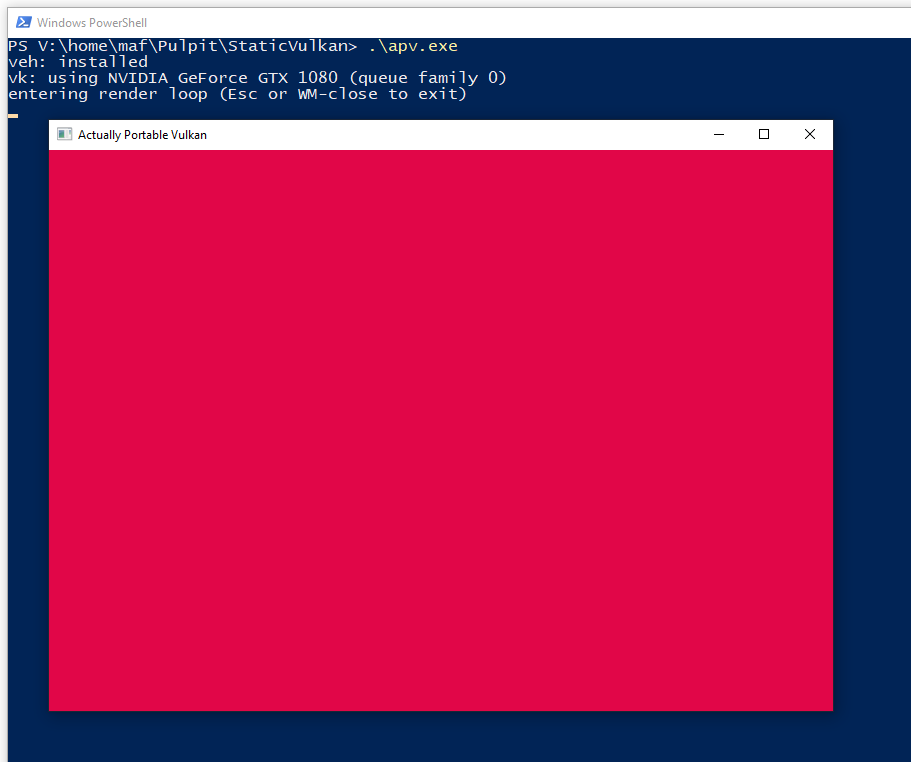
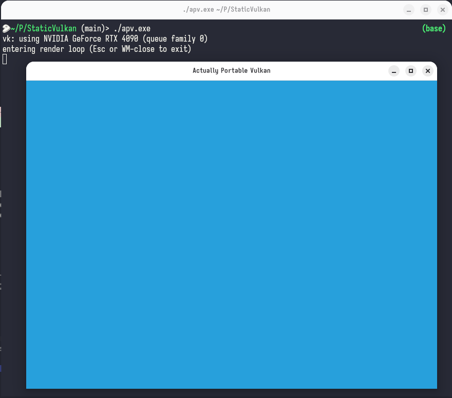
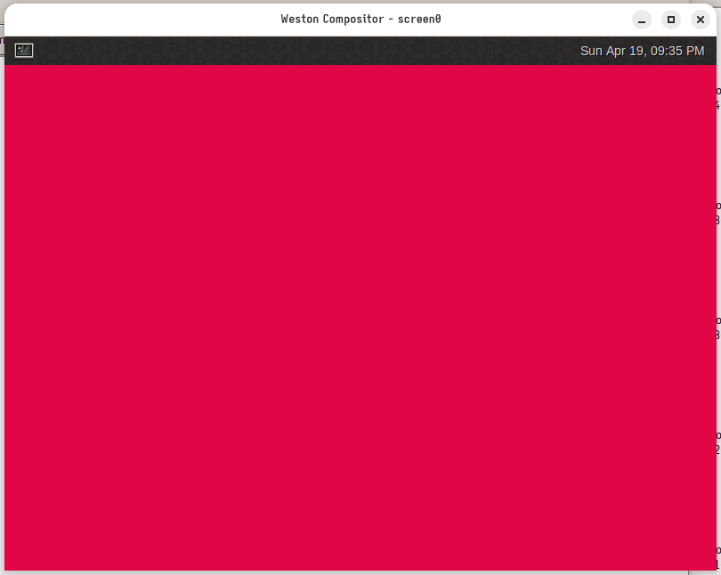

# Actually Portable Vulkan

Shipping games should be simple.

This is a proof-of-concept for a single binary that is a valid Windows .EXE and simultaneously can natively execute on Linux (without Wine). It can access native Vulkan drivers on both platforms, create a window, and render to it. The same file can be distributed to users of both platforms without any changes.

It builds upon Actually Portable Executables (a pretty cursed executable format) & foreign-dlopen (another proof-of-concept that allows statically-linked binary to dlopen shared libraries on any host libc).

Similar approach may be used for other APIs (e.g. audio, accessibility, input) to distribute regular apps as a single dependency-free binaries.

<table>
  <tr>
    <th>Windows</th>
    <th>Linux X11</th>
    <th>Linux Wayland</th>
  </tr>
  <tr>
    <td><code>> .\apv.exe</code></td>
    <td><code>$ ./apv.exe</code></td>
    <td><code>$ weston -- ./apv.exe</code></td>
  </tr>
  <tr>
    <td></td>
    <td></td>
    <td></td>
  </tr>
  </table>

## Challenges

APE & Cosmopolitan libc take us most of the way. But showing a Vulkan surface is not as simple as it seems.

### Nvidia's Vulkan drivers depend on libxcb.so

Nvidia drivers have some hidden out-of-band dependency on `libxcb.so`. If you try to link your own libxcb statically, it will collide with whatever Nvidia's drivers linked against.

The solution was to load `libxcb.so` dynamically, using foreign-dlopen (vendored into Cosmopolitan libc as `cosmo_dlopen`).

(The real solution would be for Nvidia to use the X11 protocol rather than out-of-band dependency on `libxcb.so`.)

### Cosmopolitan's signal handlers

To properly interoperate with Windows-native code, Cosmopolitan has to swap between two different TLS bases (one valid for SysV code, one valid for the Windows code). The default exception handlers that Cosmopolitan provides for Windows don't deal with that properly. Unfortunately, quite a few Win32 APIs throw (benign) exceptions. When handled by Cosmopolitan, they lead to crashes.

The solution was to install a custom Windows exception handler before Cosmopolitan, that ignores the benign exceptions and fixes the TLS base before forwarding to Cosmopolitan's own handler.

(The real solution would be for Cosmopolitan to ignore the benign exceptions & fix the TLS base automatically.)

### Default stack size is too small for Nvidia's drivers' threads

APE linker by default produces PE files with the default stack size of 64 KiB and offers no way to increase this default. When Nvidia's drivers spawn their threads, they quickly run out of the stack space and crash.

The solution was to patch the PE header after linking to increase the default stack size.

(The real solution would be for the APE linker to increase the default stack size to MSVC's default and offer an option to tweak it.)

## Demo

### Linux X11

```
$ ldd apv.exe
    not a dynamic executable
$ ./apv.exe
vk: using NVIDIA GeForce RTX 4090 (queue family 0)
entering render loop (Esc or WM-close to exit)
```

Result:


### Linux Wayland

```
$ weston --no-config --socket=apv-test \
	        --width=800 --height=600 \
	        -- ./apv.exe
```

Result:


### Windows

```
> .\apv.exe
```

Result:


## Missing features

### vkGetInstanceProcAddr / vkGetDeviceProcAddr & cosmo_dltramp

There are some vital functions in Vulkan that are used to resolve other Vulkan functions. They are often passed to other libraries (e.g. Skia) as an entry-point to the Vulkan API. To properly interoperate with SysV code, these functions should only return SysV-compatible function pointers. It's not a problem on Linux but on Windows this should be done by wrapping the returned function pointers with `cosmo_dltramp`. The proof-of-concept does this statically for a few functions, but if you'd like to interoperate with other Vulkan-wrapping libraries, an ABI-aware wrapper for `vkGetInstanceProcAddr` / `vkGetDeviceProcAddr` is needed.

# Footnotes

This work was done as part of the [Automat project](https://github.com/mafik/automat).

License: MIT
